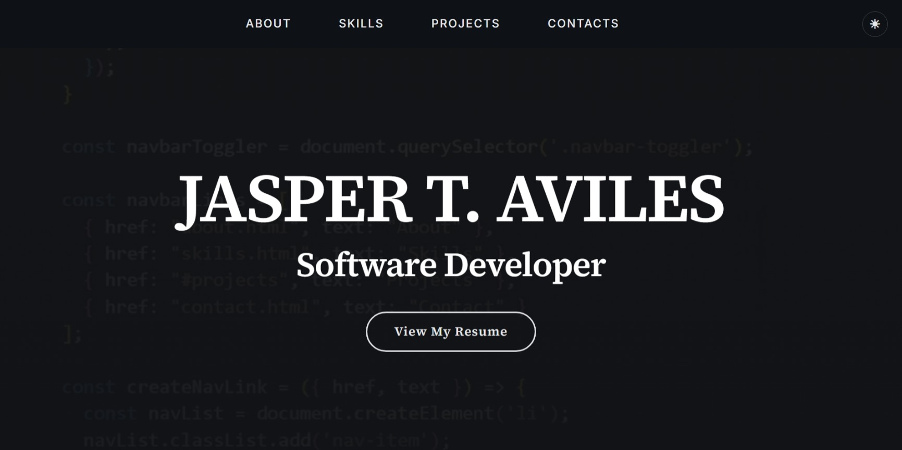
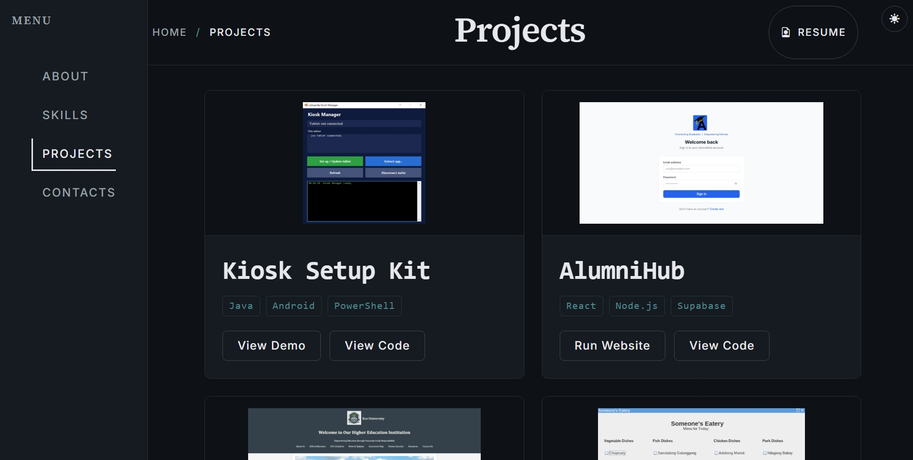

# Jasper T. Aviles — Portfolio

[](https://github.com/jasperaviles54/portfolio/actions/workflows/ci.yml)

A modern, dark-themed developer portfolio built with vanilla HTML, CSS, and JavaScript. Features a video hero landing page, interactive Java applet demos via CheerpJ, a server-side contact form with spam protection, and a fully functional noscript fallback.

🔗 **Live site:** [jasperaviles54.github.io/portfolio](https://jasperaviles54.github.io/portfolio/)

---

## Features

- 🎬 **Video hero landing page** — autoplay background video with poster fallback
- 🌗 **Dark / light theme toggle** — preference saved in `localStorage`
- ☕ **In-browser Java demos** — CheerpJ 3 runs `.jar` files directly in the browser
- 📬 **Server-side contact form** — Supabase storage + Resend email notifications
- 🤖 **Spam protection** — honeypot field + IP-based rate limiting (5/hr)
- 📄 **Print-friendly resume** — dedicated resume page optimized for printing
- ♿ **Noscript fallback** — a separate [CSS-only version](https://github.com/jasperaviles54/portfolio-noscript) for users with JavaScript disabled
- 🔍 **SEO-ready** — Open Graph / Twitter meta tags, `sitemap.xml`, `robots.txt`
- 📊 **Privacy-respecting analytics** — Vercel Analytics (no cookies)
- 🔄 **CI/CD** — automated linting (ESLint, Stylelint, HTML Validate) and Lighthouse audits

---

## Screenshots




---

## Tech Stack

| Layer | Technology |
|---|---|
| **Markup** | HTML5, semantic elements |
| **Styling** | Vanilla CSS, Bootstrap 5.3 (grid + utilities) |
| **Scripting** | Vanilla JavaScript (ES modules) |
| **Java Demos** | CheerpJ 3 (JVM in the browser) |
| **Backend** | Vercel Serverless Functions (Node.js) |
| **Database** | Supabase (PostgreSQL) |
| **Email** | Resend (transactional email API) |
| **Analytics** | Vercel Analytics (privacy-respecting, no cookies) |
| **Hosting** | GitHub Pages (static) + Vercel (API) |

---

## Architecture

```
Browser (GitHub Pages)
  │
  ├── portfolio/          ← JS-enabled version
  │     └── script.js     ← form submit, theme toggle, nav
  │
  └── portfolio-noscript/ ← CSS-only fallback (separate repo)
        └── redirect <script> → portfolio/ if JS is available

POST /api/submit
  │
  ├── Honeypot check      → silent 200 if bot
  ├── Rate limiter        → 429 if >5/hr per IP
  ├── Input validation    → 400 if missing fields
  ├── Supabase insert     → stores { email, message, timestamp }
  └── Resend email        → notifies site owner (fire-and-forget)
```

See [`docs/architecture.md`](docs/architecture.md) for a detailed Mermaid diagram.
See the [portfolio-noscript](https://github.com/jasperaviles54/portfolio-noscript) repo for the CSS-only fallback.

---

## Project Structure

```
├── index.html              # Hero landing page with video background
├── about.html              # About me + profile card
├── skills.html             # Skills grid + certifications
├── projects.html           # Project cards with Java demos
├── contacts.html           # Contact form (Supabase backend)
├── resume.html             # Print-friendly resume page
├── 404.html                # Custom 404 page
├── java-demo.html          # CheerpJ Java applet launcher
├── styles.css              # Complete design system
├── script.js               # Client-side logic
├── api/
│   └── submit.js           # Vercel serverless function
├── contact/icons/          # Social media SVG icons
├── projects/logos/         # Project thumbnails
├── skills/logos/           # Skill + certification images
├── docs/
│   ├── architecture.md     # Mermaid architecture diagram
│   └── screenshots/        # README screenshots
├── .github/workflows/
│   └── ci.yml              # Lint + Lighthouse CI
├── package.json            # Dependencies (Supabase, Resend, linters)
├── CONTRIBUTING.md         # Branch naming + commit conventions
└── LICENSE                 # MIT License
```

---

## Local Development

### Prerequisites
- [Node.js](https://nodejs.org/) (v18+)
- [Vercel CLI](https://vercel.com/docs/cli) (`npm i -g vercel`)

### Setup

```bash
# Clone the repository
git clone https://github.com/jasperaviles54/portfolio.git
cd portfolio

# Install dependencies
npm install

# Start local dev server with Vercel (handles serverless functions)
vercel dev
```

---

## Environment Variables

| Variable | Description | Required |
|---|---|---|
| `SUPABASE_URL` | Your Supabase project URL | ✅ |
| `SUPABASE_SERVICE_ROLE_KEY` | Supabase service role key (server-side only) | ✅ |
| `RESEND_API_KEY` | Resend API key for email notifications | ✅ |
| `NOTIFY_TO_EMAIL` | Email address to receive contact form notifications | ✅ |

These variables are configured in the **Vercel dashboard** under **Settings → Environment Variables** — not via a local `.env` file.

---

## Deployment

### GitHub Pages (Static Site)
The root directory is deployed to GitHub Pages. Push to `main` and configure Pages to serve from the root.

### Vercel (Serverless API)
The `api/submit.js` function is deployed to Vercel. Environment variables must be configured in the Vercel dashboard under **Settings → Environment Variables**.

---

## Browser Support

| Browser | Status | Notes |
|---|---|---|
| Chrome / Edge (Chromium) | ✅ Full support | CheerpJ Java demos work best here |
| Firefox | ✅ Full support | |
| Safari | ✅ Full support | |
| Browsers with JS disabled | ⚠️ Fallback | Redirected to [portfolio-noscript](https://jasperaviles54.github.io/portfolio-noscript/) |

> **Note:** CheerpJ 3 requires a modern browser with WebAssembly support. The Java demo pages will not function in older browsers.

---

## Accessibility

- **Noscript fallback** — a fully functional [CSS-only version](https://jasperaviles54.github.io/portfolio-noscript/) for users with JavaScript disabled
- **Skip-to-content links** — keyboard users can bypass the navigation
- **Semantic HTML** — proper landmark elements (`<nav>`, `<main>`, `<footer>`)
- **ARIA labels** — navigation and interactive elements are labeled for screen readers
- **Lighthouse audits** — automated accessibility checks run on every push to `main`

---

## License

This project is licensed under the MIT License — see the [LICENSE](LICENSE) file for details.

---

## Acknowledgments

- [Bootstrap 5](https://getbootstrap.com/) — responsive grid and utilities
- [CheerpJ 3](https://cheerpj.com/) — Java-to-WebAssembly compiler
- [Google Fonts](https://fonts.google.com/) — Inter and Source Serif 4 typefaces
- [Supabase](https://supabase.com/) — open-source PostgreSQL backend
- [Resend](https://resend.com/) — transactional email API
- [Vercel](https://vercel.com/) — serverless functions and analytics

---

## Author

**Jasper T. Aviles** — Software Developer

- 🌐 [Portfolio](https://jasperaviles54.github.io/portfolio/)
- 💻 [GitHub](https://github.com/jasperaviles54)
