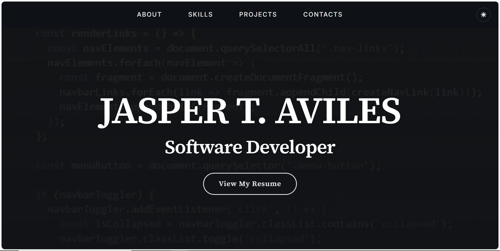
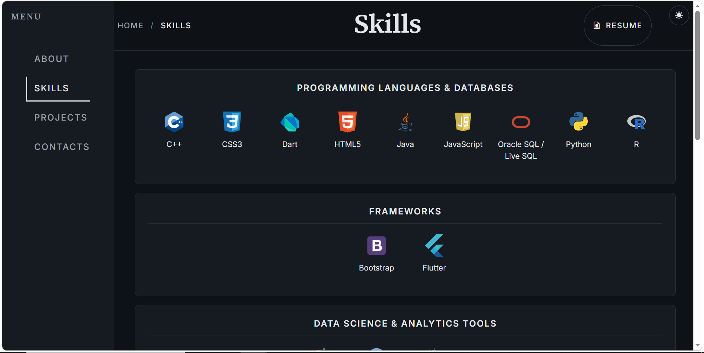
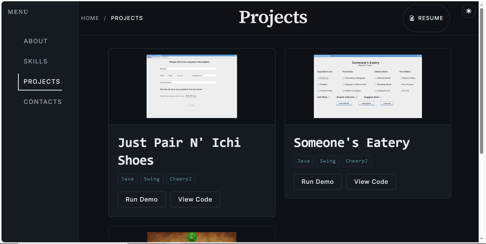
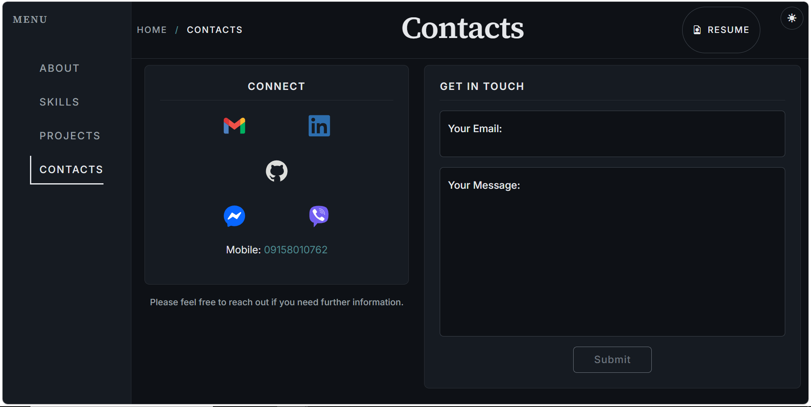

# Jasper T. Aviles — Portfolio

[](https://github.com/jasperaviles54/jasperaviles54.github.io/actions/workflows/ci.yml)
A modern, dark-themed developer portfolio built with vanilla HTML, CSS, and JavaScript. Features a video hero landing page, interactive Java applet demos via CheerpJ, a server-side contact form with spam protection, and a fully functional noscript fallback.

🔗 **Live site:** [jasperaviles54.github.io/portfolio](https://jasperaviles54.github.io/portfolio/)

---

## Screenshots







---

## Tech Stack

| Layer | Technology |
|---|---|
| **Markup** | HTML5, semantic elements |
| **Styling** | Vanilla CSS, Bootstrap 5.3 (grid + utilities) |
| **Scripting** | Vanilla JavaScript (ES modules) |
| **Java Demos** | CheerpJ 3 (JVM in the browser) |
| **Backend** | Vercel Serverless Functions (Node.js) |
| **Database** | Supabase (PostgreSQL) |
| **Email** | Resend (transactional email API) |
| **Analytics** | Vercel Analytics (privacy-respecting, no cookies) |
| **Hosting** | GitHub Pages (static) + Vercel (API) |

---

## Architecture

```
Browser (GitHub Pages)
  │
  ├── portfolio/          ← JS-enabled version
  │     └── script.js     ← form submit, theme toggle, nav
  │
  └── portfolio-noscript/ ← CSS-only fallback
        └── redirect <script> → portfolio/ if JS is available

POST /api/submit
  │
  ├── Honeypot check      → silent 200 if bot
  ├── Rate limiter        → 429 if >5/hr per IP
  ├── Input validation    → 400 if missing fields
  ├── Supabase insert     → stores { email, message, timestamp }
  └── Resend email        → notifies site owner (fire-and-forget)
```

See [`docs/architecture.md`](docs/architecture.md) for a detailed Mermaid diagram.

---

## Project Structure

```
main/
├── portfolio/                 # JS-enabled site (deployed to GitHub Pages)
│   ├── index.html             # Hero landing page with video background
│   ├── about.html             # About me + profile card
│   ├── skills.html            # Skills grid + certifications
│   ├── projects.html          # Project cards with Java demos
│   ├── contacts.html          # Contact form (Supabase backend)
│   ├── resume.html            # Print-friendly resume page
│   ├── 404.html               # Custom 404 page
│   ├── styles.css             # Complete design system
│   ├── script.js              # Client-side logic
│   ├── api/
│   │   └── submit.js          # Vercel serverless function
│   ├── contact/icons/         # Social media SVG icons
│   ├── projects/logos/         # Project thumbnails
│   └── skills/logos/           # Skill + certification images
│
├── portfolio-noscript/        # CSS-only fallback (noscript users)
│   ├── [same page structure]
│   └── styles.css             # Adapted styles (no JS dependencies)
│
└── WR/                        # Working records & documentation
    └── portfolio-improvements-plan.md
```

---

## Local Development

### Prerequisites
- [Node.js](https://nodejs.org/) (v18+)
- [Vercel CLI](https://vercel.com/docs/cli) (`npm i -g vercel`)

### Setup

```bash
# Clone the repository
git clone https://github.com/jasperaviles54/jasperaviles54.github.io.git
cd jasperaviles54.github.io/portfolio

# Install dependencies
npm install

# Create a .env file from the example
cp .env.example .env
# Fill in your actual values (see Environment Variables below)

# Start local dev server with Vercel (handles serverless functions)
vercel dev
```

---

## Environment Variables

| Variable | Description | Required |
|---|---|---|
| `SUPABASE_URL` | Your Supabase project URL | ✅ |
| `SUPABASE_SERVICE_ROLE_KEY` | Supabase service role key (server-side only) | ✅ |
| `RESEND_API_KEY` | Resend API key for email notifications | ✅ |
| `NOTIFY_TO_EMAIL` | Email address to receive contact form notifications | ✅ |

See [`.env.example`](.env.example) for the template.

---

## Deployment

### GitHub Pages (Static Site)
The `portfolio/` directory is deployed to GitHub Pages. Push to `main` and configure Pages to serve from the root.

### Vercel (Serverless API)
The `portfolio/api/submit.js` function is deployed to Vercel. Environment variables must be configured in the Vercel dashboard under **Settings → Environment Variables**.

---

## License

This project is licensed under the MIT License — see the [LICENSE](LICENSE) file for details.
