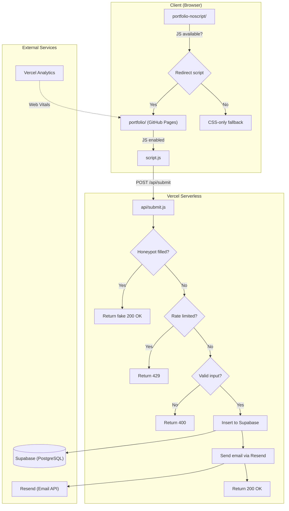

# Architecture

## System Overview

## Request Flow

1. **User visits site** → GitHub Pages serves static HTML/CSS/JS from `portfolio/`
2. **Noscript fallback** → `portfolio-noscript/` contains a `<script>` redirect. If JS runs, user goes to the main site. If JS is disabled, the CSS-only version renders.
3. **Contact form submit** → `script.js` sends a `POST` to `https://portfolio-jasperaviles54.vercel.app/api/submit`
4. **Server-side pipeline** in `api/submit.js`:
   - **Honeypot check** — if the hidden `website` field is filled, return a fake `200 OK` (bot thinks it succeeded)
   - **Rate limiter** — in-memory, max 5 submissions per hour per IP
   - **Input validation** — `email` and `message` are required
   - **Supabase insert** — stores `{ email, message, timestamp }`
   - **Resend email** — sends a plain-text notification to the site owner (fire-and-forget, wrapped in separate try/catch)

## Hosting Setup

| Component | Host | Purpose |
|---|---|---|
| Static site | GitHub Pages | HTML, CSS, JS, images |
| Serverless API | Vercel | `api/submit.js` — form handler |
| Database | Supabase | PostgreSQL — stores submissions |
| Email | Resend | Transactional email notifications |
| Analytics | Vercel Analytics | Privacy-respecting page analytics |

## Theme System

The site uses CSS custom properties (`--color-*`) with a `[data-theme="light"]` attribute toggle. The theme preference is stored in `localStorage` and applied on page load via `script.js`.
